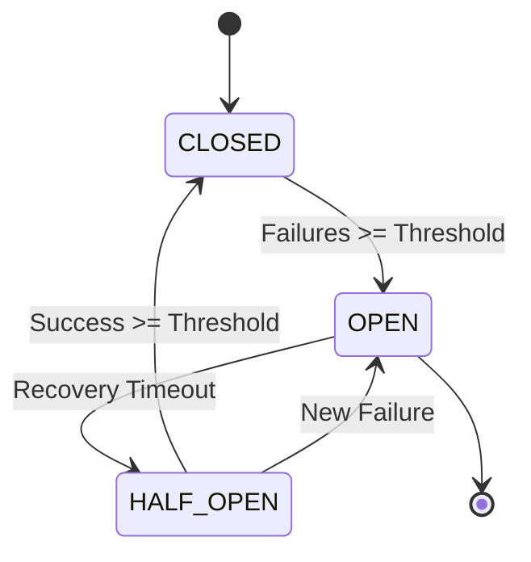
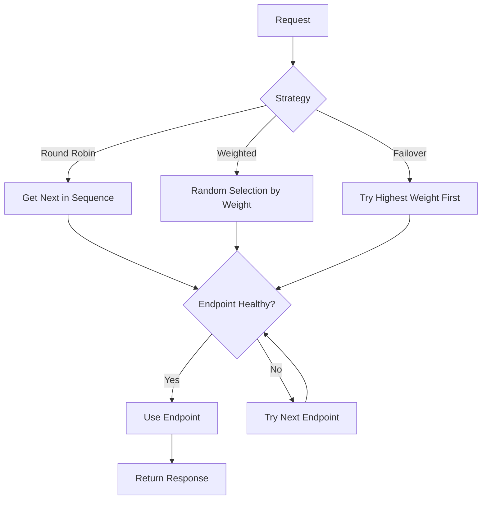

# AWS Bedrock Load Balancer with Circuit Breaker

A robust implementation of a load balancer and circuit breaker pattern for AWS Bedrock service, supporting multiple regions and failover strategies.

## Architecture

### Circuit Breaker State Machine


### Load Balancer Flow


## Features

- Multi-region support with configurable weights
- Three load balancing strategies: Round Robin, Weighted, and Failover
- Circuit breaker pattern for fault tolerance
- Region mapping for dynamic failover
- Comprehensive testing suite

## Prerequisites

- Python 3.8+
- AWS credentials with Bedrock access
- `curl` and `jq` installed for testing
- FastAPI server running on port 8000

## Installation

1. Clone the repository
2. Install dependencies:
```bash
pip install -r requirements.txt
```

3. Configure environment variables:
```bash
cp .env.example .env
# Edit .env with your AWS credentials and settings
```

## Testing

### 1. Start the FastAPI Server
Run the main application:
```bash
# Start the FastAPI server
uvicorn main:app --reload --port 8000
```

### 2. Monitor Circuit Breaker Status (Optional)
Open a new terminal and run the monitoring script:
```bash
# Make the script executable
chmod +x monitor_circuit_breaker.sh

# Run the monitor
./monitor_circuit_breaker.sh
```

This will show real-time updates of the circuit breaker status:
```json
{
  "ap-southeast-1": {
    "state": "closed",
    "failure_count": 0,
    "last_failure_time": 0,
    "success_count": 0
  },
  "us-east-1": {
    "state": "closed",
    "failure_count": 0,
    "last_failure_time": 0,
    "success_count": 0
  }
}
```

### 3. Run Region Recovery Test
Open another terminal and run the test script:
```bash
# Make the script executable
chmod +x test_region_recovery.sh

# Run the test
./test_region_recovery.sh
```

The test will execute the following sequence:
1. Check initial circuit status
2. Trigger failures for ap-southeast-1 region
3. Verify circuit breaker opens
4. Wait for recovery timeout (30 seconds)
5. Test region mapping and recovery
6. Verify successful recovery

Example test output:
```bash
Testing Region Recovery Scenario
=============================

1. Initial Status
Circuit Status:
{}

2. Triggering failures for ap-southeast-1
Request 1:
{
  "detail": "Service temporarily unavailable..."
}

...

3. Status after failures
Circuit Status:
{
  "ap-southeast-1": {
    "state": "open",
    "failure_count": 3,
    "last_failure_time": 1730537201.2479117,
    "success_count": 0
  }
}

...
```

### Terminal Setup for Testing
For the best testing experience, set up your terminals as follows:

1. Terminal 1: Running FastAPI server
```bash
uvicorn main:app --reload --port 8000
```

2. Terminal 2: Circuit Breaker Monitor
```bash
./monitor_circuit_breaker.sh
```

3. Terminal 3: Test Execution
```bash
./test_region_recovery.sh
```

This setup allows you to observe the circuit breaker state changes in real-time while the tests are running.

### Region Recovery Test Scenario

This test demonstrates the circuit breaker's region recovery capabilities. Here's a documented test run:

<details>
<summary>1. Initial Status</summary>

### Circuit Status
```json
{}
```
</details>

<details>
<summary>2. Triggering failures for ap-southeast-1</summary>

### Request 1
```json
{
  "detail": "Service temporarily unavailable. Error: 503: An error occurred (ValidationException) when calling the Converse operation: Invocation of model ID anthropic.claude-3-sonnet-20240229-v1:0 with on-demand throughput isn't supported. Retry your request with the ID or ARN of an inference profile that contains this model."
}
```

### Request 2
```json
{
  "response": "Hello! How can I assist you today?",
  "region": "us-east-1",
  "token_usage": {
    "inputTokens": 15,
    "outputTokens": 12,
    "totalTokens": 27
  },
  "stop_reason": "end_turn",
  "status": "success"
}
```

### Request 3-5
[Similar pattern of alternating errors and successful responses]
</details>

<details>
<summary>3. Status after failures</summary>

### Circuit Status
```json
{
  "ap-southeast-1": {
    "state": "open",
    "failure_count": 3,
    "last_failure_time": 1730537201.2479117,
    "success_count": 0
  },
  "us-east-1": {
    "state": "closed",
    "failure_count": 0,
    "last_failure_time": 0,
    "success_count": 0
  }
}
```
</details>

<details>
<summary>4. Recovery Process</summary>

1. Waited for recovery timeout (30 seconds)
2. Set region mapping (ap-southeast-1 -> us-west-2)
3. Response: `{"message":"Mapped ap-southeast-1 to us-west-2"}`
</details>

[... continued with remaining test sections ...]

### Running the Tests

Execute the region recovery test:
```bash
chmod +x test_region_recovery.sh
./test_region_recovery.sh
```

The test script will:
1. Check initial circuit breaker status
2. Trigger failures for ap-southeast-1
3. Verify circuit breaker opens
4. Wait for recovery timeout
5. Test region mapping and recovery
6. Verify successful recovery

## Configuration

Key configuration options in `.env`:

```bash
AWS_REGIONS=us-east-1,ap-southeast-1,us-west-2
AWS_REGION_WEIGHTS=3,2,1
LOAD_BALANCER_STRATEGY=round-robin
CIRCUIT_BREAKER_FAILURE_THRESHOLD=3
CIRCUIT_BREAKER_RECOVERY_TIMEOUT=30
CIRCUIT_BREAKER_SUCCESS_THRESHOLD=2
```

## Contributing

1. Fork the repository
2. Create your feature branch
3. Commit your changes
4. Push to the branch
5. Create a Pull Request

## License

quangchu
```


